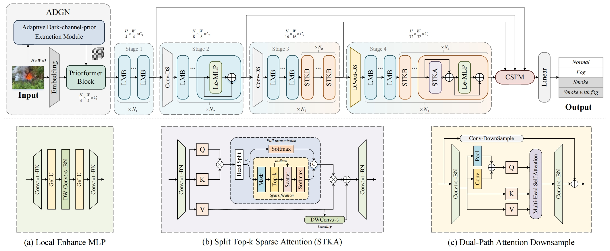
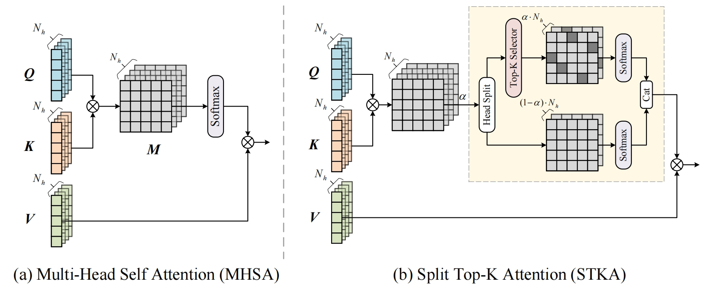
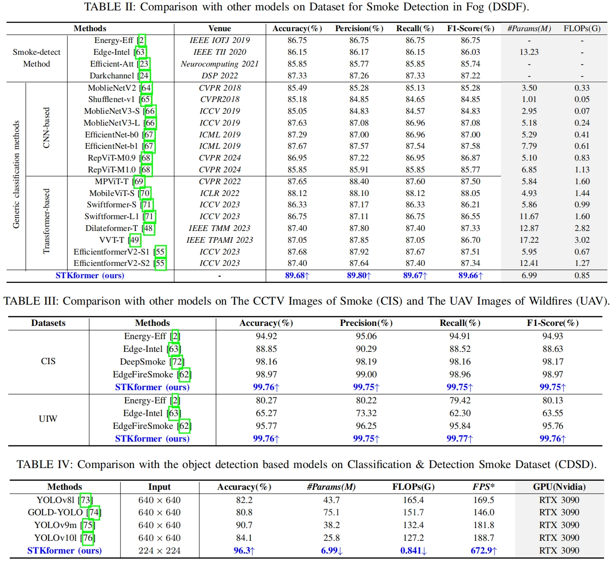

# Real-Time Smoke Detection with Split Top-k Transformer and Adaptive Dark Channel Prior in Foggy Environments (IEEE IOTJ accepted)

 Jiongze Yu, Heqiang Huang, Yuhang Ma, Yueying Wu, Junzhou Chen, Ronghui Zhang, Xuemiao Xu, Zhihan Lv, and Guodong Yin

[Paper Download](https://ieeexplore.ieee.org/document/10745603)

> **Abstract:** *Smoke detection is essential for fire prevention, yet it is significantly hampered by the visual similarities between smoke and fog. To address this challenge, a Split Top-k Attention Transformer Framework (STKformer) is proposed. The STKformer incorporates Split Top-k Attention (STKA), which partitions the attention map for top-k selection to retain informative self-attention values while capturing long-range dependencies. This approach effectively filters out irrelevant attention scores, preventing information loss. Furthermore, the Adaptive Dark-channel-prior Guidance Network (ADGN) is designed to enhance smoke recognition under foggy conditions. ADGN employs pooling operations instead of minimum value filtering, allowing for efficient dark channel extraction with learnable parameters and adaptively reducing the impact of fog. The extracted prior information subsequently guides feature extraction through a Priorformer block, improving model robustness. Additionally, a Cross-Stage Fusion Module (CSFM) is introduced to aggregate features from different stages efficiently, enabling flexible adaptation to smoke features at various scales and enhancing detection accuracy. Comprehensive experiments demonstrate that the proposed method achieves state-of-the-art performance across multiple datasets, with an accuracy of 89.68% on DSDF, 99.76% on CIS, and 99.76% on UIW. The method maintains high speed and lightweight characteristics, validated with an inference speed of 211.46 FPS on an NVIDIA Jetson AGX Orin after TensorRT acceleration, confirming its effectiveness and efficiency for real-world applications.

## Method

Flowchart of industrial smoke alarm system in foggy conditions.


**STKformer architecture.** The upper part illustrates the overall architecture of our proposed STKformer. The lower part contains three subfigures detailing the internal components. (a) presents the internal details of the Le-MLP. (b) demonstrates the computational process of the STKA. (c) showcases the computational process of the Dual-Path Attention Downsample.


Comparison of the computational diagrams for Multi-Head Self Attention (MHSA) and our proposed Split Top-K Attention (STKA).


## Datasets
* Please download the corresponding datasets and put them in the folder `datasets`.
* The download link for the dataset is below:
<table>
<thead>
  <tr>
    <th>Dataset</th>
    <th>DSDF</th>
    <th>CIS</th>
    <th>UIW</th>
    <th>CDSD</th>
  </tr>
</thead>
<tbody>
  <tr>
    <td>Download</td>
    <td> <a href="https://pan.baidu.com/s/1TEzyt8w2C2z06hj2M-yNsg?pwd=4wz8 ">Download </a> </td>
    <td> <a href="https://github.com/jefferson2021ufc/EdgeFireSmoke?tab=readme-ov-file">Download </a> </td>
    <td> <a href="https://github.com/jefferson2021ufc/EdgeFireSmoke?tab=readme-ov-file">Download </a> </td>
    <td> <a href="https://pan.baidu.com/s/1vBM0YgsfKiWIXwFKic6m1g?pwd=1bx3 ">Download </a> </td>
  </tr>
</tbody>
</table>

* The file structure of the downloaded dataset is as follows.
* Please note that the `detection` folder within the CDSD dataset contains bounding box labels, which can be used for comparison with object detection methods.

```
datasets
├── DSDF
│   ├── train
│   └── val
├── CIS
│   ├── train
│   ├── test
│   └── val
├── UIW
│   ├── train
│   ├── test
│   └── val
└── CDSD
    ├── classification
    │   ├── train
    │   └── val
    └── detection
        ├── train
        └── val
```

## Requirements
* To install requirements: 
```
pip install -r requirements.txt
```

## Training
We first pretrain the network on ImageNet for 300 epochs. The training command is as follows, where `{$PATH_IMAGE_NET}` represents the path to the ImageNet dataset.
```
python -m torch.distributed.launch --nproc_per_node 4 --master_port 12345 main.py --batch_size 256 --batch_size 300 --base_lr 1e-3 --warmup_lr 1e-6 --min_lr 1e-5 --model_name STKformer_0_75_100_25 --data_path {$PATH_IMAGE_NET} --tag STKformer_0_75_100_25_300epochs_4gpu_256_imagenet
```
Next, we fine-tune the network on the corresponding smoke dataset. The training command is as follows. `{$DATASET}` indicates the name of the dataset used.
```
python -m torch.distributed.launch --nproc_per_node 2 --master_port 12345 main.py --batch_size 64 --model_name STKformer_0_75_100_25 --data_path ./datasets/{$DATASET} --tag STKformer_0_75_100_25_100epochs_2gpu_64 --load_ckpt ./output/STKformer_0_75_100_25/STKformer_0_75_100_25_100epochs_4gpu_256_imagenet/model-best.pth
```

## Testing
The validation command for the model is as follows. When testing the inference speed (FPS), please set the batch size to 1.
```
python evaluate.py --batch_size 1 --model_name STKformer_0_75_100_25 --data_path ./datasets/DSDF --load_ckpt ./weights/STKformer_0_75_100_25/model-best.pth
```
Additionally, our model underwent TensorRT optimization for acceleration to meet engineering requirements. We first convert the `.pth` model to an ONNX format using `weights/pt2onnx.py`, and then convert it to a TensorRT `.trt` model. We used TensorRT version 8.6.1 on both Jetson AGX Orin and RTX 3090. 
The command for testing the TensorRT-optimized model is as follows.
```
python evaluate.py --batch_size 1 --model_name STKformer_0_75_100_25 --data_path ./datasets/DSDF --load_ckpt ./weights/STKformer_0_75_100_25/model-best.trt
```

## Experiment result


## Pre-trained Models
The trained weight files for different datasets are listed below, including both `.pth` and `.trt` formats.

<table>
<thead>
  <tr>
    <th>Weights</th>
    <th>ckpt</th>
    <th>tensorrt</th>
  </tr>
</thead>
<tbody>
  <tr>
    <td>Baidu Cloud</td>
    <td> <a href="https://pan.baidu.com/s/1728RkFAG8tYlpF5OkoGc0A?pwd=b32l ">Download </a> </td>
    <td> <a href="https://pan.baidu.com/s/1kuYaKuQSgCHmTxgcrthM7w?pwd=1nqm ">Download </a> </td>
  </tr>
</tbody>
</table>

## Citation
If you use STKformer, please consider citing:
```
@ARTICLE{10745603,
  author={Yu, Jiongze and Huang, Heqiang and Ma, Yuhang and Wu, Yueying and Chen, Junzhou and Zhang, Ronghui and Xu, Xuemiao and Lv, Zhihan and Yin, Guodong},
  journal={IEEE Internet of Things Journal}, 
  title={Real-Time Smoke Detection with Split Top-k Transformer and Adaptive Dark Channel Prior in Foggy Environments}, 
  year={2024},
  doi={10.1109/JIOT.2024.3492347}}
```

## Contact
Should you have any question or suggestion, please contact yujz3@mail2.sysu.edu.cn
